### Hi, I’m wasabina67 👋
Thank you for visiting my GitHub profile.

#### GitHub Readme Stats

Powered by [anuraghazra/github-readme-stats](https://github.com/anuraghazra/github-readme-stats)

#### Clock Apps
- [Cat Clock using The Cat API](https://wasabina67.is-a.dev/cat-clock/)
- [Dog Clock using The Dog API](https://wasabina67.is-a.dev/dog-clock/)
- [timeis](https://wasabina67.is-a.dev/timeis/)

#### Chrome Extensions
- [ClipMark - Chrome Web Store](https://chromewebstore.google.com/detail/clipmark/ljfcfnfiaecponbjcbgemoggojcilcch?hl=en)
- [ClipTitle - Chrome Web Store](https://chromewebstore.google.com/detail/cliptitle/fhjdloooegpencmhkinhoamobgahidkm?hl=en)
- [ZenSlugCleaner - Chrome Web Store](https://chromewebstore.google.com/detail/zenslugcleaner/kiibffolmdjcfgmdnmnailcpljoicjcl?hl=en)
<!--
- [ElementHider - Chrome Web Store](https://example.com/)
-->

##### **Last updated**: 2026-01-25
